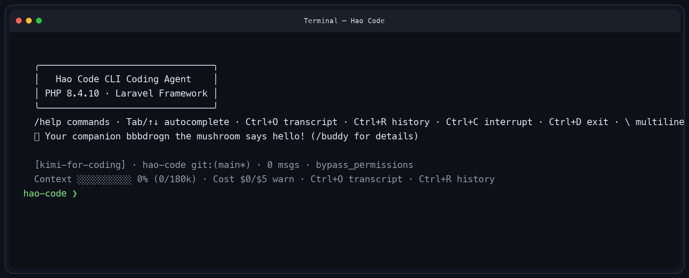

# Hao Code

An interactive CLI coding agent built with Laravel for Anthropic-compatible endpoints.

[](https://php.net)
[](https://laravel.com)
[](LICENSE)

`REPL` · `Streaming` · `Sub-agents` · `Tasks` · `Hooks` · `Skills` · `Session HUD`

## Preview



## Highlights

- **Interactive REPL** — history, multiline input, transcript browsing, slash-command autocomplete
- **30+ built-in tools** — shell, files, search, LSP, web, cron, tasks, worktrees, notebooks
- **Agent system** — background agents, parallel read-only tools via `pcntl_fork`, plan mode
- **Safety controls** — permission modes, hook system, cost tracking with warning/hard-stop thresholds
- **Session management** — restore, branch, fork, context compaction
- **Extensible** — custom skills, multi-provider config, project/global settings

---

## Quick Start

### Global install

```bash
composer global require sk-wang/hao-code
export PATH="$(composer global config bin-dir --absolute):$PATH"
```

Configure API key:

```bash
mkdir -p ~/.haocode
cat > ~/.haocode/settings.json <<'JSON'
{
  "api_key": "sk-ant-your-key-here"
}
JSON
```

Launch:

```bash
hao-code
```

### Local development

```bash
git clone https://github.com/sk-wang/hao-code.git
cd hao-code
composer install
cp .env.example .env && php artisan key:generate
echo "ANTHROPIC_API_KEY=sk-ant-your-key-here" >> .env
php artisan hao-code
```

---

## Usage

```bash
hao-code                                          # Interactive REPL
hao-code --print="Explain AgentLoop.php"          # Single-shot
hao-code --continue                               # Resume latest session
hao-code --resume=20260404_abcdef12               # Resume specific session
hao-code --resume=ID --fork-session --name="alt"  # Fork into new branch
```

### CLI flags

| Flag | Purpose |
| --- | --- |
| `-p, --print=` | Run once and exit |
| `-c, --continue` | Reopen latest session |
| `-r, --resume=` | Restore session by ID |
| `--fork-session` | Branch into new transcript |
| `--name=` | Set session display name |
| `--model=` | Override model |
| `--system-prompt=` | Replace system prompt |
| `--append-system-prompt=` | Append extra instructions |
| `--permission-mode=` | Override permission mode |

---

## Configuration

Settings are read from `~/.haocode/settings.json` (global) and `.haocode/settings.json` (project).

```json
{
  "api_key": "sk-ant-...",
  "model": "claude-sonnet-4-20250514",
  "permission_mode": "default",
  "stream_output": false
}
```

Multi-provider example:

```json
{
  "active_provider": "zai",
  "provider": {
    "anthropic": {
      "api_key": "sk-ant-...",
      "model": "claude-sonnet-4-20250514"
    },
    "zai": {
      "api_key": "your-zai-key",
      "api_base_url": "https://api.z.ai/api/anthropic",
      "model": "glm-5.1"
    }
  }
}
```

Auto-loaded project files: `HAOCODE.md`, `CLAUDE.md`, `.haocode/rules/*.md`, `.haocode/memory/MEMORY.md`

---

## Slash Commands

<details>
<summary><strong>Session</strong> — /help /exit /clear /history /resume /branch /rewind /snapshot /transcript /search</summary>
</details>

<details>
<summary><strong>Context & Output</strong> — /status /statusline /stats /context /cost /model /provider /fast /theme /output-style</summary>
</details>

<details>
<summary><strong>Workspace</strong> — /files /diff /commit /review /memory /config /permissions /hooks /skills /mcp /init /doctor /version</summary>
</details>

<details>
<summary><strong>Planning</strong> — /plan /tasks /loop</summary>
</details>

---

## Built-in Tools

| Group | Tools |
| --- | --- |
| **Shell & Files** | Bash, Read, Edit, Write, Glob, Grep |
| **Agents & Planning** | Agent, SendMessage, TodoWrite, EnterPlanMode, ExitPlanMode |
| **Tasks & Automation** | TaskCreate/Get/List/Update/Stop, CronCreate/Delete/List, Sleep |
| **Code Intelligence** | LspTool, NotebookEdit, EnterWorktree, ExitWorktree |
| **Web & Interaction** | WebSearch, WebFetch, AskUserQuestion, ToolSearch, Skill, Config |

---

## Permissions and Hooks

**Permission modes:** `default` (confirm dangerous ops) · `plan` (read-only) · `accept_edits` (auto-accept file edits) · `bypass_permissions`

```json
{
  "permissions": {
    "allow": ["Bash(git:*)", "Read(*:*)"],
    "deny": ["Bash(rm -rf *)"]
  },
  "hooks": {
    "PreToolUse": [{ "command": "echo 'About to run'", "matcher": "Bash" }],
    "PostToolUse": [{ "command": "notify-send 'Done'" }]
  }
}
```

Hook events: `SessionStart` · `Stop` · `PreToolUse` · `PostToolUse` · `PostToolUseFailure` · `PreCompact` · `PostCompact` · `Notification`

---

## Skills

Create custom skills in `.haocode/skills/` or `~/.haocode/skills/`:

```text
.haocode/skills/
├── commit/SKILL.md
├── review/SKILL.md
└── test/SKILL.md
```

Supports `$ARGUMENTS` substitution, session variables, `allowedTools`, model overrides, and inline shell interpolation. Use `/skills` to inspect.

---

## Testing

```bash
composer test
# or
php vendor/bin/phpunit
```

---

## Requirements

- PHP 8.2+, Composer
- `pcntl` recommended (signal handling, parallel tools)
- `ripgrep` recommended (fast grep)

---

**[MIT License](LICENSE)** · Built with Laravel 12 · Powered by Anthropic-compatible APIs
